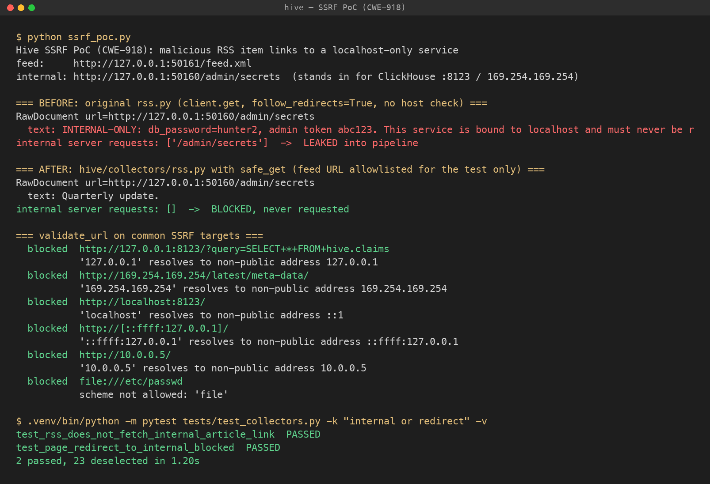

# Semgrep Guardian findings

Semgrep Guardian ran as a Claude Code hook in every build session, scanning each file as it was written. This log records every finding, with what it was and how we fixed it. Each session appends its own entries.

| Session | Rule ID | File:line | Finding | Fix |
|---|---|---|---|---|
| D (senso, writer, docs) | none | `hive/senso/client.py`, `hive/writer/brief.py` | Guardian scanned both files on write and reported no findings | n/a |
| Collectors | none | `hive/collectors/*.py` | Guardian scanned every collector file on write and reported no findings. Manual hardening: SSRF, XXE, path traversal, unbounded responses (see `tests/test_collectors.py`) | `safe_get` in `_common.py`: http/https only, rejects non-public IPs, re-checks each redirect hop, 2 MB body cap; `resolve_fixture` confines paths to `fixtures/`; feeds containing `<!ENTITY` are rejected; lxml parses with `no_network=True` |
| D found it, Collectors fixed it | CWE-918 SSRF (manual review, PoC confirmed) | `hive/collectors/rss.py` `_fetch_article`, `hive/collectors/page.py` `collect` (original versions) | Article links from untrusted feeds were fetched with no scheme or host check and with redirects followed. A feed item could make Hive read localhost services (ClickHouse :8123, cloud metadata) into the pipeline. See Finding 1 | `safe_get` in `_common.py` (Collectors row) |
| D found it, fix routed to ClickHouse session | CWE-306 / CWE-352 missing auth on the event store (manual review) | `clickhouse/docker-compose.yml` (`CLICKHOUSE_PASSWORD: ""`, ports `8123`/`9000` on all interfaces), `dashboard/index.html` (`CH` URL) | The monitoring plane's own database accepts unauthenticated queries from the LAN, and from any web page the operator opens. See Finding 2 | Bind to 127.0.0.1, give the writer user a password, add a read-only `dashboard` user |

## Finding 1: SSRF through RSS article links

**Where.** In the original `hive/collectors/rss.py`, `_fetch_article` called `client.get(url)` for every `<link>` in a fetched feed. The client was built with `follow_redirects=True`, and there was no scheme or host check and no size cap. `page.py` had the same pattern.

**Why it matters.** A feed is attacker-controlled input. One malicious `<item><link>` can point the collector at:

- ClickHouse on `http://localhost:8123/?query=SELECT ...`, which leaks claims, run logs and trust scores
- cloud metadata at `169.254.169.254`, which leaks credentials
- any other service bound to localhost or a private network

The response body becomes a `RawDocument` that goes to the reader agent, gets logged to ClickHouse and can end up in a brief. That is an exfiltration path from internal services into the pipeline's output. A public URL that redirects to an internal address bypasses a naive host check in the same way.

**Evidence:** [`semgrep/ssrf_poc.png`](semgrep/ssrf_poc.png) (screenshot) and [`semgrep/ssrf_poc.txt`](semgrep/ssrf_poc.txt) (raw output).



**Reproduce:** `.venv/bin/python docs/semgrep/ssrf_poc.py`

The script starts a localhost-only "internal" server that returns `db_password=hunter2`, plus a feed whose single item links to it. It then runs:

- **Before:** [`semgrep/vuln_rss.py`](semgrep/vuln_rss.py), a verbatim copy of the original fetch logic. The internal page is requested, and its secret becomes a `RawDocument`.
- **After:** the current `hive/collectors/rss.py`, with only the feed URL allowlisted for the test. The internal server receives zero requests.

It also checks common SSRF targets against `validate_url`.

**Automated regression tests** (in `tests/test_collectors.py`, written by the collectors session from this PoC):

- `test_rss_does_not_fetch_internal_article_link`: the internal article link is never requested, and no doc contains the secret.
- `test_page_redirect_to_internal_blocked`: an allowed URL that 302-redirects to an internal one raises `UnsafeURLError`, and the internal URL is never requested.

**Fix** (written by the collectors session in `hive/collectors/_common.py`):

- `validate_url` allows only `http` and `https` and rejects credentials in the URL. It resolves the host and rejects private, loopback, link-local, multicast, reserved, unspecified and non-global addresses, including IPv4-mapped IPv6.
- `safe_get` turns off `follow_redirects` and follows up to 5 redirects manually, re-validating every hop. It caps the body at 2 MB, checked against `Content-Length` and again while streaming.
- `rss.py` sends the feed and every article through `safe_get`. It rejects feeds that declare `<!ENTITY` (XXE and billion laughs), and feedparser receives only bytes, never a URL.
- `edgar.py` uses `safe_get` with a host allowlist (`efts.sec.gov`, `www.sec.gov`). `page.py` uses `safe_get`.

**Remaining risk.** DNS rebinding. The IP is validated at resolve time but not pinned for the connection. To close this, connect to the validated IP with a `Host` header, or use a custom transport.

## Finding 2: Unauthenticated ClickHouse behind the monitoring plane

**Where.** `clickhouse/docker-compose.yml` runs as user `default` with `CLICKHOUSE_PASSWORD: ""`, `CLICKHOUSE_DEFAULT_ACCESS_MANAGEMENT: "1"`, and ports `8123:8123` and `9000:9000`, which Docker publishes on `0.0.0.0`. The dashboard sends queries to `http://localhost:8123/?add_http_cors_header=1` without credentials.

**Evidence** (read-only check against the running container):

```
$ docker ps   ->  tokenshackathon-clickhouse 0.0.0.0:8123->8123/tcp, 0.0.0.0:9000->9000/tcp
$ curl 'http://localhost:8123/?query=SELECT currentUser(), getSetting('readonly')'
default	2
```

GET requests run with `readonly=2`, but ClickHouse runs POST bodies with the user's full rights, and `default` can manage access. We did not live-test a write, to avoid modifying the shared demo database.

**Why it matters.** ClickHouse is the source of truth for the security layer: quarantine decisions, injection events and source trust all come from it.

- Anyone on the same network (venue wifi) can `DROP` or `ALTER` tables, delete `injection_events` to hide an attack, or raise a malicious source's `source_trust` so its claims stop being quarantined.
- A web page open in the operator's browser can send a `fetch('http://localhost:8123/', {method: 'POST', mode: 'no-cors', body: 'INSERT ...'})`. It's a simple request with no CORS preflight, so the write runs even though the page can't read the response. This is CSRF against the monitoring plane.

**Fix** (owned by the ClickHouse session):

1. Publish the ports on loopback only: `127.0.0.1:8123:8123` and `127.0.0.1:9000:9000`.
2. Give the writer user a password, set through `CLICKHOUSE_URL=http://hive:<pw>@localhost:8123` (`hive/telemetry.py` already reads credentials from the URL).
3. Add a `dashboard` user with `readonly=1` and only `SELECT ON hive.*`. The dashboard sends `user` and `password` parameters, and a leaked read-only credential can't write.

## Hardening applied in session D without a finding

- The Senso API key goes only in the `X-API-Key` header. It never appears in a URL, a log line or an exception message.
- A `402` from Senso raises `SensoCreditsExhausted`, so callers stop instead of retrying in a loop. A `401` raises an explicit auth error.
- Error messages include at most 300 characters of the response body.
- The writer wraps passages in delimiters and tells the model to treat them as data. It also checks every citation the model returns and drops any sentence that has no valid `[n]`, so an uncited claim cannot reach a brief even if the model ignores its prompt.
- `LocalKB` writes `data/kb.json` atomically through a temp file and `os.replace`.

## Screenshot

Finding 1: [`semgrep/ssrf_poc.png`](semgrep/ssrf_poc.png). Guardian showed no popup in session D, so the PoC run is the evidence.
